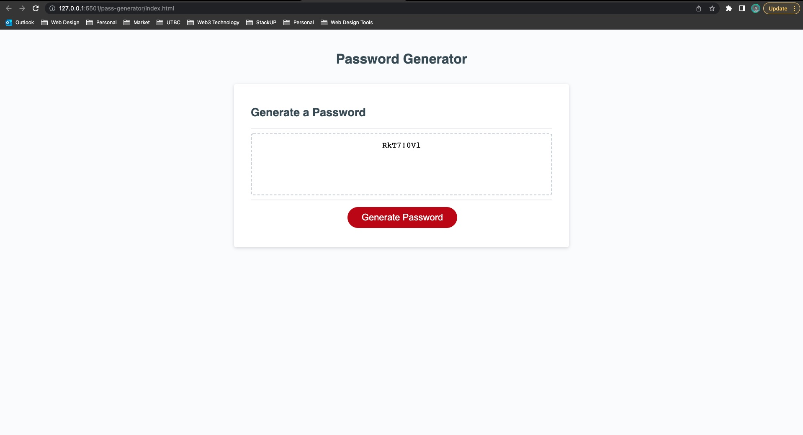

---

## Live Link

[Live Link](https://natenaranjo.github.io/utbc/pass-generator/)

---

# Description

This project was tasked with creating a password generator.  
Giving a few prompts to the user to allow a selection of requirements the password needs.  

### Requirements: 
-[x] When click on generate a password button, am presented a series of prompts.
-[x] When prompted for length, must choose between 8 and 128 length.
-[x] When asked whether to include lowercase, uppercase, numerical, or special characters. 
-[x] When all prompts are answered, am presented with a password.